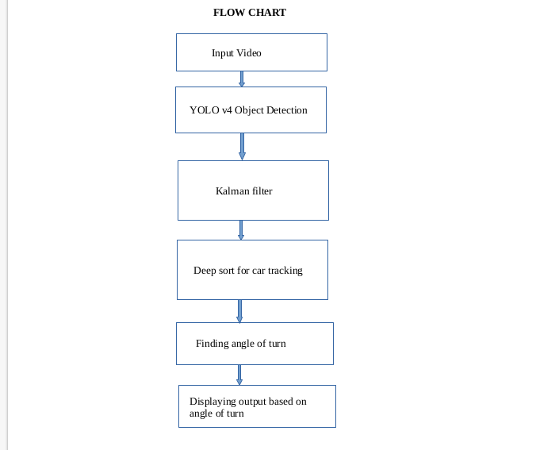

# Vehicle-direction-identification
Vehicle direction identification consists of three module detection , tracking and direction recognization.

### Algorithm used : Yolo algorithm for detection + SORT algorithm to track vehicles + vector based direction detection
### Backend : opencv and python
### Library required:

- opencv = '4.5.4-dev'
- scipy = '1.4.1'
- filterpy 
- lap
- scikit-image

# Quick Overview about structure

# Object Detection:
 Downloaded yolov4 tiny pretrained weights,yolov4 config file and coco names,created a json file which has the path of the weight files and yolov4.config  and coco names .loaded the model on python script

# Object Tracking:
# Step 1. 
The detection generation: We apply efficient YOLOv4-tiny to produce the detections for each video frame.

# Step 2. 
The appearance feature extraction: The appearance features of each detection are extracted through a convolutional neural network.

# Step 3. 
The tracklet location prediction: We can obtain the predicted location of every
tracklet in the next frame by utilizing the Kalman filter.

# Step 4. 
The matching cascade: We calculate the appearance feature similarity and location distance between the confirmed tracklets and detections. After that, the association results of the confirmed tracklets and detections are obtained through the Hungarian algorithm.

# Step 5.
 The IOU matching: We compute the intersection-over-union (IOU) between the detection boxes and predicted bounding boxes of candidate tracklets. After that, the association results of the candidate tracklets and detections are obtained through the Hungarian algorithm.

# Step 6.
 The motion state updating: This involves combining the association results of matching cascade and IOU matching, and dividing all tracklets into associated tracklets and unassociated tracklets. In addition, all detections are divided into matched detections and unmatched detections. Then, we update the estimated motion states for tracklets and initialize new tracklets for unmatched detections. For associated tracklets, the estimated motion states are updated by means of a Kalman filter. Firstly, the tractor computes Kalman gain. Determining Kalman gain is a critical step in establishing the Kalman filter model, which significantly impacts the efficiency and accuracy of filtering. 

# Vehicle direction detection:
After tracking the cars, finding the direction of movement of the vehicle. To get direction by considering the two  points of object location from previous frames, Drawing an imaginary line between the  points and finding the location of the new tracked position (point)  with respect to line formed. Assuming the points are (Ax,Ay) (Bx,By) and (Cx,Cy), you need to compute:
                   (Bx - Ax) * (Cy - Ay)  -  (By - Ay) * (Cx - Ax)
If the above computed value is less than or equal to -1, we  say the vehicle is taking a left turn , if greater than 1, it takes a right turn and if it is equal to 0 we  say it is moving in a straight line.

### Limitations:

There are few primary drawbacks of this appoach

1) direction recogization totally depends on detection and tracking.
2) if camera properly arranged then it gives accurate results (Suppose any object is in front of camera and come forward towards camera then it gives bad results)
    but if you try to use this approach in cctv suviellence then it gives satisfactory results.
    
3) in few cases , it performs bad, because right now it works on only single keypoint (center of object) we can improve its performace by detecting multiple keypoints and use majority votes result.
 
## If it's helful for you then please give star :)

